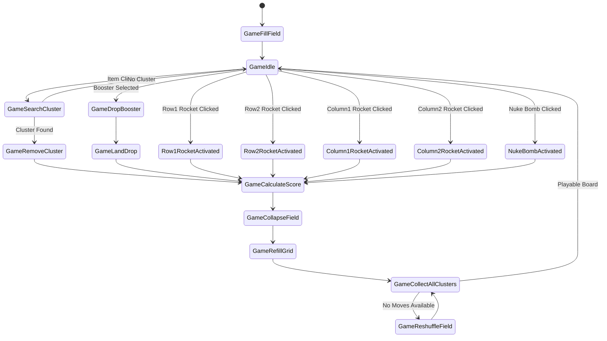

# Blast Demo Game

A blast style puzzle game, featuring a robust state machine architecture and special power-ups (boosters).

## Game Description

This is a grid-based puzzle game where players need to match clusters of similar items to score points. The game features various special items (boosters) that can help clear the board in different ways:

- **Rockets**: Clear entire rows or columns
  - Row Rocket 1: Clears entire selected row
  - Row Rocket 2: Clears selected row and adjacent rows
  - Column Rocket 1: Clears entire selected column
  - Column Rocket 2: Clears selected column and adjacent columns
- **Nuke Bomb**: Powerful booster that affects a large area

### Game Rules
- Minimum cluster size: 4 items
- Special items appear at:
  - 6 items: Row/Column Rocket 1
  - 7 items: Row/Column Rocket 2
  - 8 items: Nuke Bomb
- Maximum reshuffles: 3

## Technical Architecture

The game is built using a Finite State Machine (FSM) architecture, which manages the game flow and ensures proper sequencing of game events.

### Core Components

1. **Game Field**: Manages the grid of items and their positions
2. **State Machine**: Controls game flow and transitions between different states
3. **Cluster Seeker**: Identifies matching clusters of items
4. **Level Configuration**: Handles level-specific settings and scoring
5. **Booster System**: Manages special items and their effects

### State Machine Diagram



## State Descriptions

1. **GameFillField**: Initializes the game board with items
2. **GameIdle**: Main state waiting for player input
3. **GameSearchCluster**: Looks for matching clusters after item selection
4. **GameRemoveCluster**: Removes matched clusters from the board
5. **GameCalculateScore**: Updates player score based on removed items
6. **GameCollapseField**: Makes items fall to fill empty spaces
7. **GameRefillGrid**: Adds new items to empty spaces
8. **GameCollectAllClusters**: Scans board for all possible moves
9. **GameReshuffleField**: Reorganizes board when no moves are available
10. **GameDropBooster**: Handles booster placement
11. **GameLandDrop**: Processes booster landing and activation

### Booster States
- **NukeBombActivated**: Handles nuke bomb explosion, affecting a large area
- **Row1RocketActivated**: Clears all items in the selected row
- **Row2RocketActivated**: Clears selected row and one row above and below
- **Column1RocketActivated**: Clears all items in the selected column
- **Column2RocketActivated**: Clears selected column and one column on each side

## Game Features

- **Scoring System**: Points awarded based on cluster size and item type
- **Move Counter**: Tracks number of moves made
- **Booster System**: Special items with unique clearing patterns
- **Auto-Reshuffle**: Board automatically reshuffles when no moves are available
- **Smooth Animations**: Items smoothly collapse and refill

## Technical Features

- **Dependency Injection**: Utilizes a custom DI system for better modularity
- **Object Pooling**: Efficiently reuses game objects
- **Event System**: Robust event handling for game actions
- **Configurable Levels**: Flexible level configuration system
- **Type Safety**: Built with TypeScript for better code reliability

## Development

This project is built with:
- Cocos Creator
- TypeScript
- Custom State Machine Implementation
- Custom Dependency Injection System

## Project Structure

```
assets/
├── Prefabs/
│   └── Drops/           # Booster prefabs
├── Scripts/
│   ├── Game/
│   │   ├── GameSM/     # State Machine
│   │   │   └── States/ # Game States
│   │   └── Base/       # Base Classes
│   ├── Services/       # Game Services
│   ├── GameField/      # Field Management
│   └── Libs/          # Core Libraries
└── Scenes/            # Game Scenes
